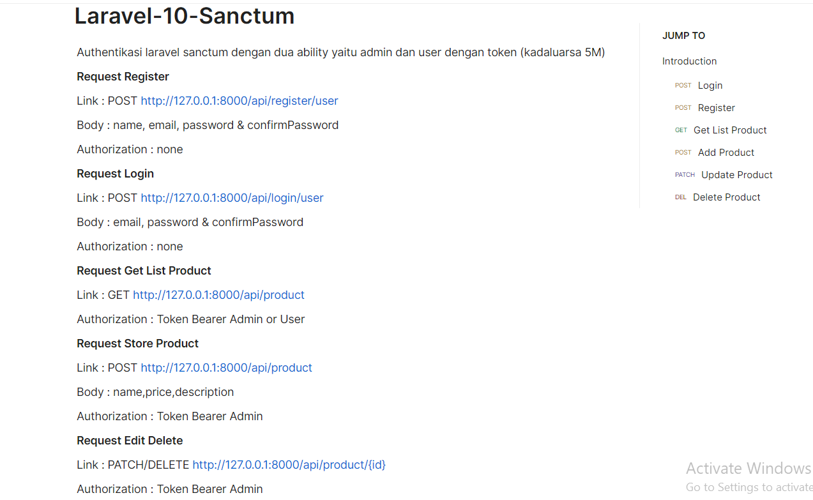
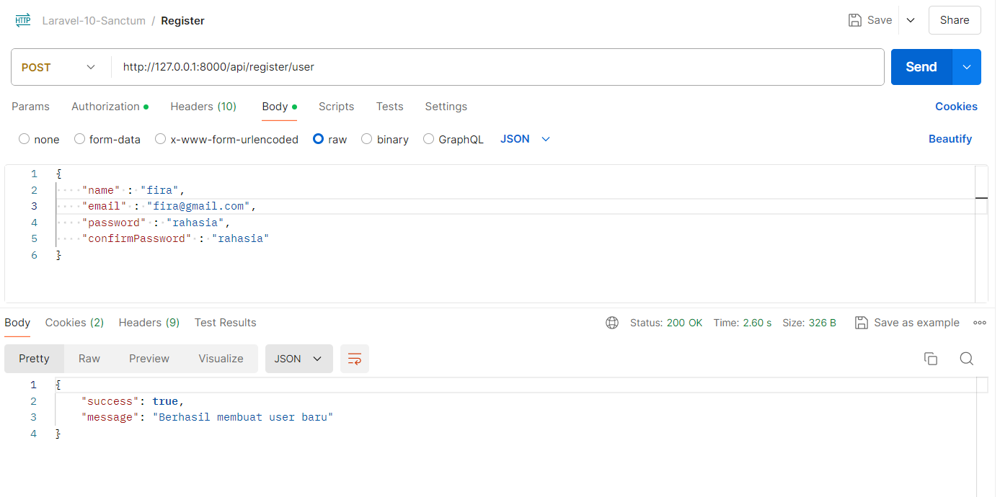
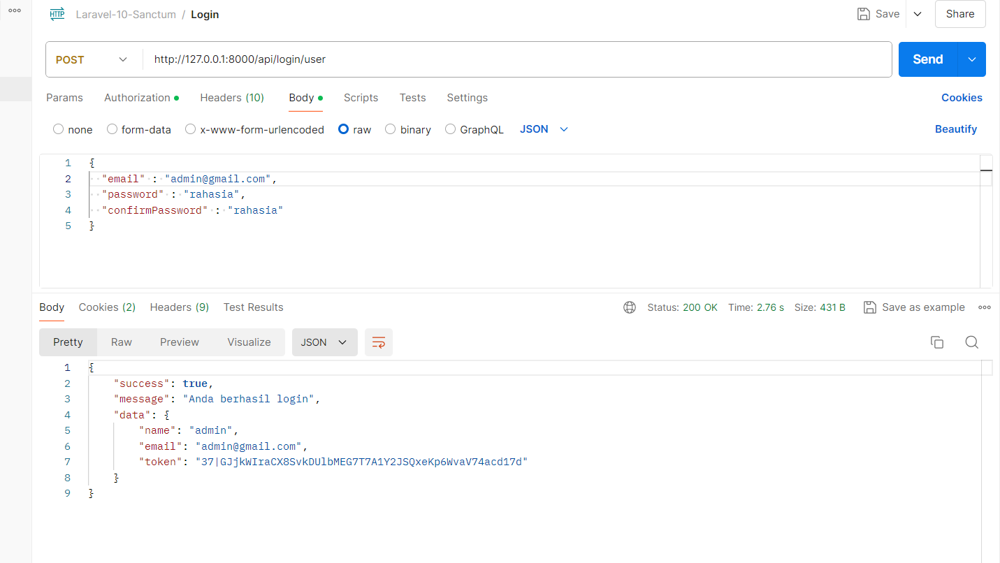
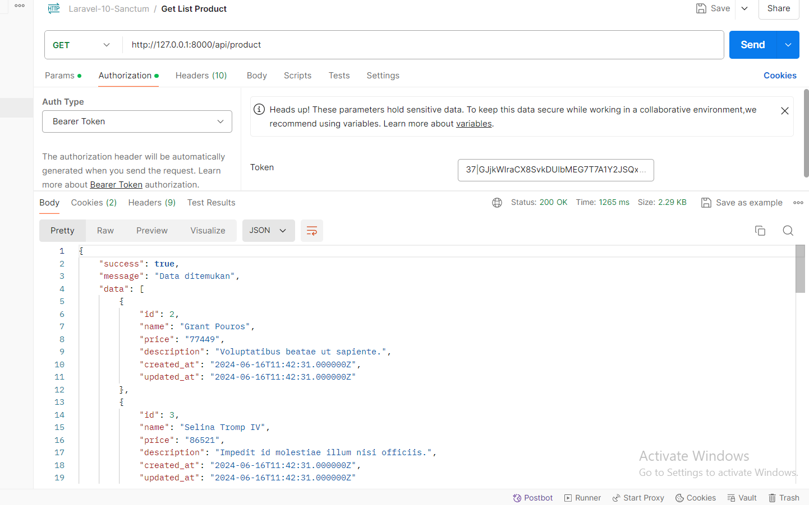
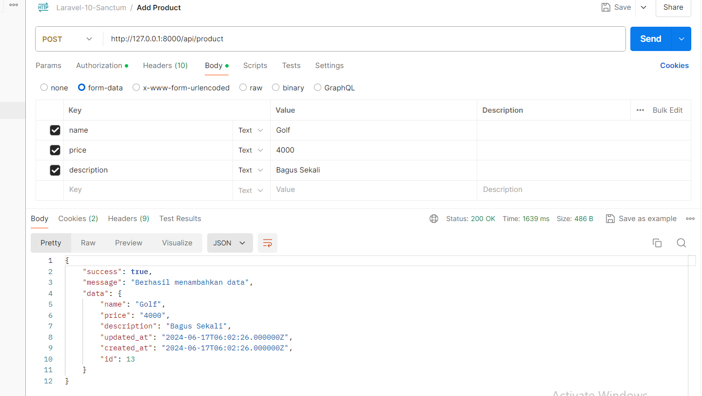
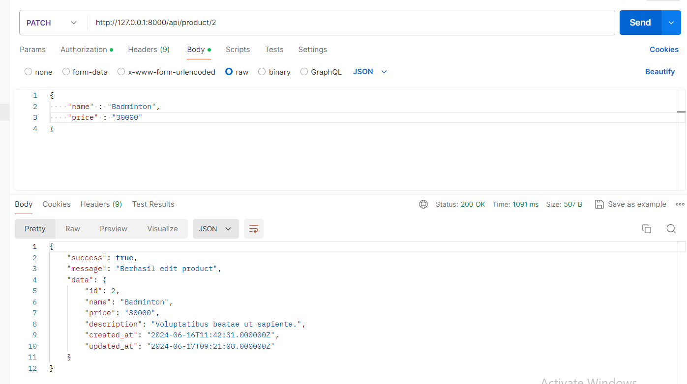
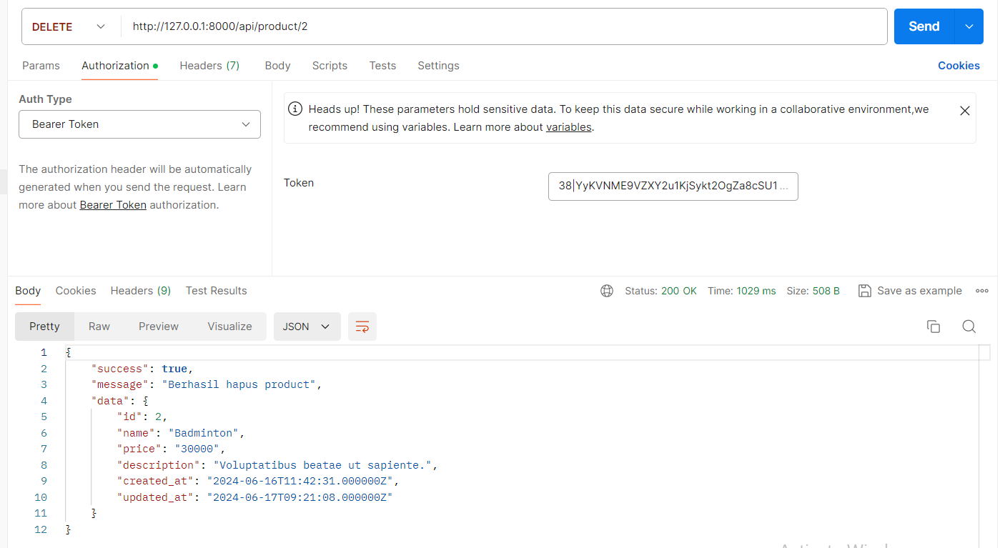

<h1>Dokumentasi RESTFull API Laravel 10 Sanctum</h1>

Berikut adalah dokumentasi pembuatan RESTFull API menggunakan laravel 10 dengan validasi atau authentikasi menggunakan Sanctum

Penjelasan secara singkat seperti berikut : 

<ul>
    <li>Studi kasusnya adalah Product (DB lewat migration / import folder DB) </li>
    <li>Terdapat 2 ability atau role yaitu admin dan user</li>
    <li>Role admin dapat melakukan CRUD Product</li>
    <li>Role user hanya bisa melakukan Read Product</li>
    <li>Terdapat 4 method yaitu GET,POST,PACTH dan DELETE</li>
    <li>Ada 7 Request Login,Register,List Product,Store,Edit dan Delete Product</li>
    <li>Dimana setiap Request List Product, dan CRUD Product diharuskan membawa token</li>
    <li>Token kadaluarsa di 6 menit kedepan (bisa di edit di AuthController.php</li>
</ul>
 

<h2>Detail Request</h2>
<ul>

 <li>List Request</li>
  
 
    
 <li>Request POST Register User</li>
 
 
    
 <li>Request POST Login User</li>
 
 
 
<li>Request GET List Product</li>
 
 
 
<li>Request POST Store Product</li>
 
 
 
<li>Request PATCH Update Product</li>
 
 
 
<li>Request DELETE Delete Product</li>
 
 
 
 </ul>
